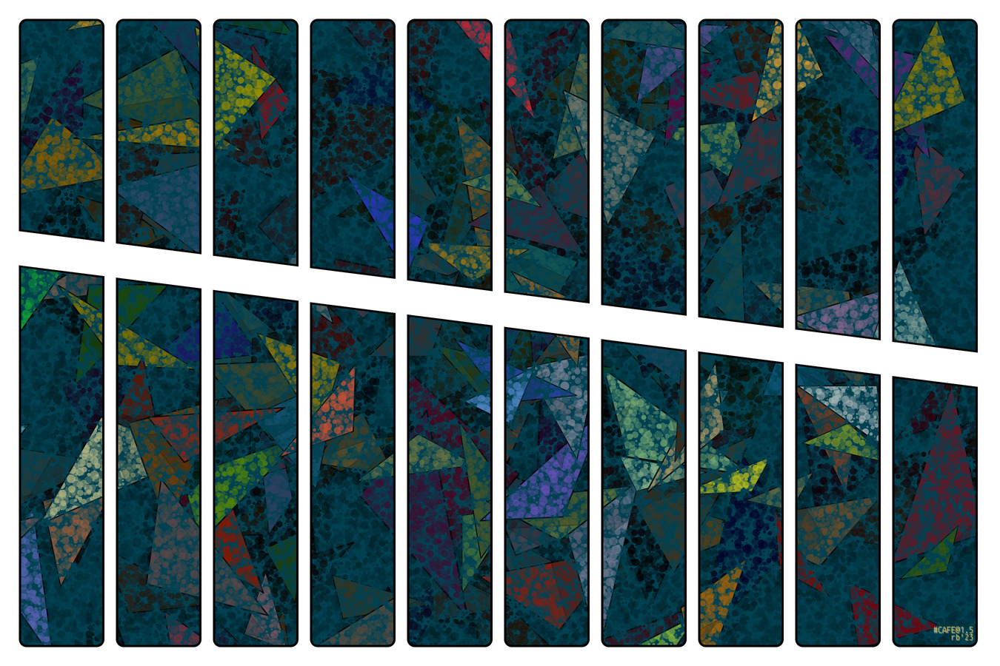
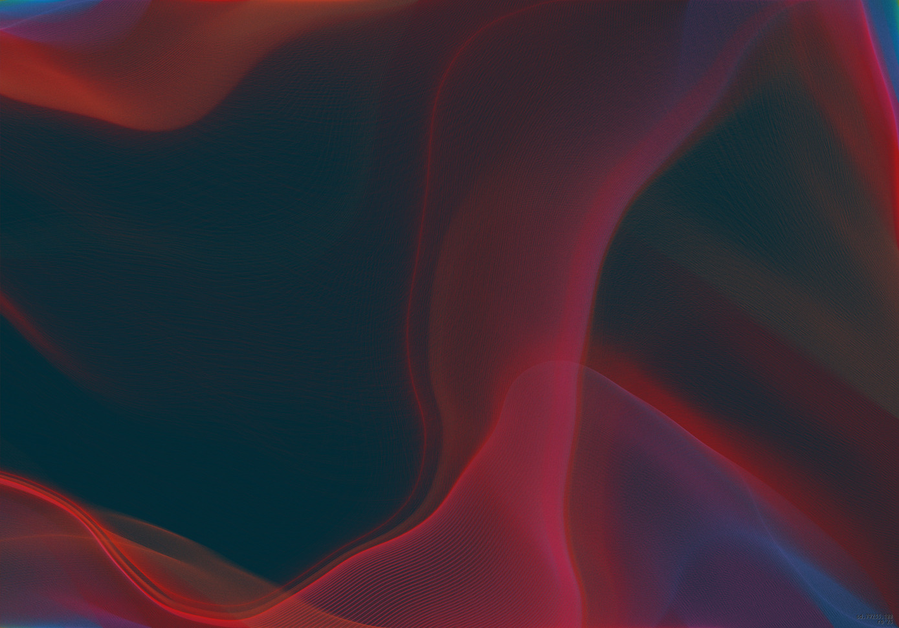
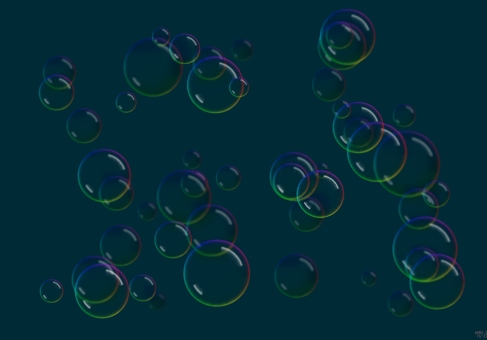

# ostrich

---

## second slide 

---

### Third slide

---

### h3
#### h4
##### h5
###### h6

---



# arstarst

Things thing

---


# arstarst

More things

---


# arstarst

More text

---

```python
for i in range(1, 100):
    foo
```

---

# Flummoxing the Grumblers

## A deep dive

---

Text






---

# The Gist of the Gribble

The primary issue is the **trans-dimensional wobble** of the frobnitz. When the floop is inadequately snorked, a cascade failure is almost **inevitable**. We must therefore address the wimble directly.

---

-   Nonsensical point number one.
-   Another item for the listicle.
-   Flibbertigibbet and other assorted notions.

---

## A Code-like Artifact

```python
def quantize_gibberish(wobble_factor):
  """A docstring that explains nothing."""
  for i in range(wobble_factor):
    thingamajig = (i * 3.14) // 2
    if thingamajig.is_snorked():
      print(f"Iteration {i} is fully snorked.")
    else:
      # This part is crucial for de-wobbling.
      re_frobnitz(thingamajig)
```

---

# Foo

## Bar

